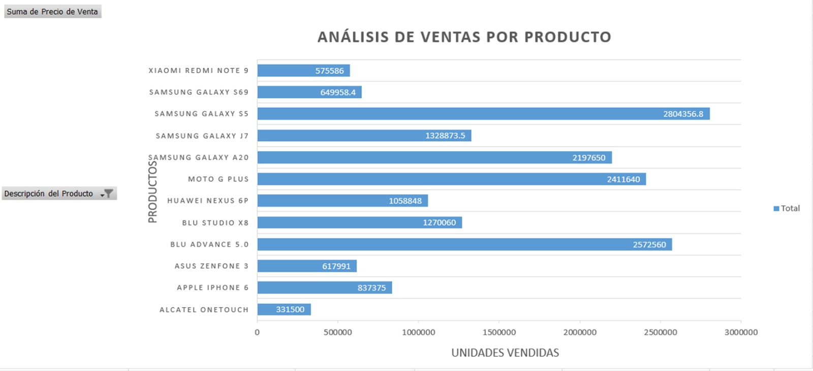
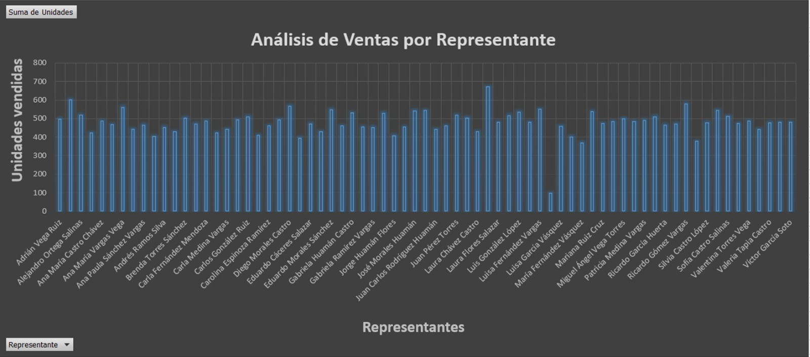
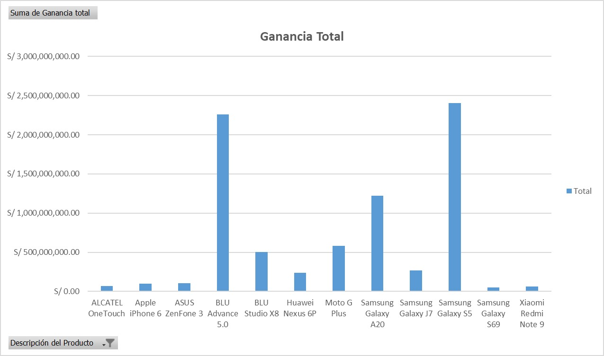
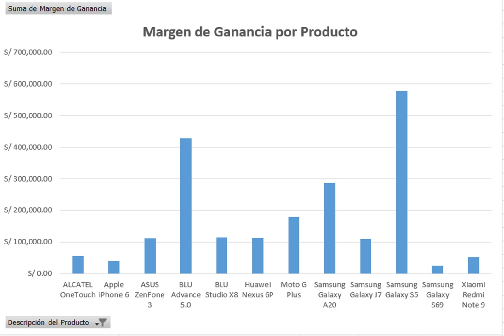
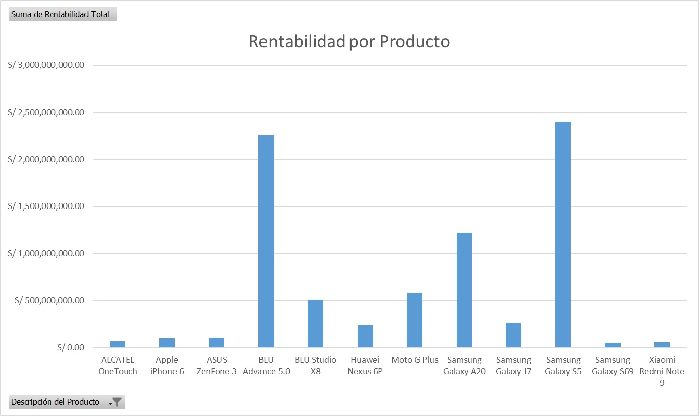
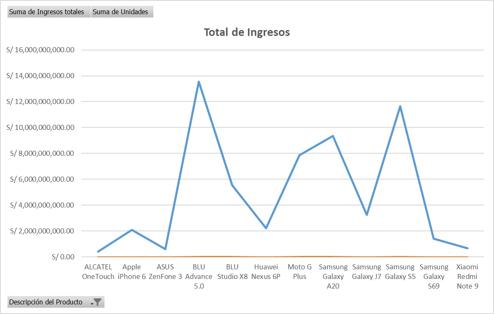
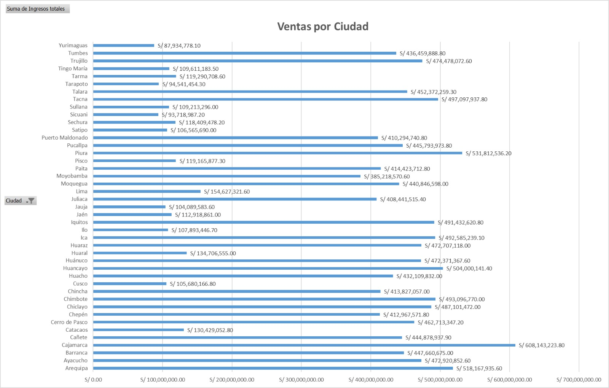

# Análisis de Ventas - Excel y VBA

Este proyecto muestra un análisis de ventas de tiendas de telefonía móvil en Perú. Utiliza Excel avanzado, Power Query y VBA para automatizar la recolección, análisis y visualización de datos.

## Tecnologías Usadas:
- **Excel avanzado**
- **Power Query**
- **VBA**
- **Tablas Dinámicas y Gráficos**

## Funcionalidades:
1. Análisis de ventas por representante.
2. Rentabilidad por producto.
3. Dashboard interactivo con gráficos.
4. Automatización de reportes y envíos de correos electrónicos con VBA.

## Instrucciones:
1. Abre el archivo **Análisis de Ventas con Excel y VBA.xlsm** en Excel.
2. Asegúrate de habilitar las macros.
3. El archivo tiene varias hojas que contienen los datos y análisis.
4. Para ejecutar las macros, ve a **Desarrollador > Macros** y selecciona la macro que deseas ejecutar.

## Capturas de pantalla:

## Licencia:
Este proyecto está bajo la licencia marko100000. Puedes usarlo y modificarlo de acuerdo con los términos de dicha licencia.
